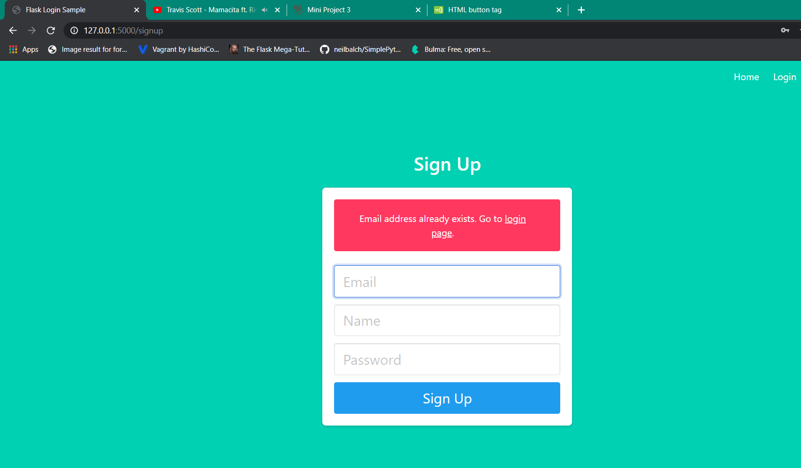

# project3

## Team Members

Ajay Kumar Selvaraj Rajagopal

Mohammed Yahya Muhammad Rafih Hassan

## Features
- [x] Implemented an interactive web interface for the calculator

- [x] Only logged in users can use the calculator

- [x] The calculator record's calculation history

- [x] The user is able to see their calculation history

- [x] The user is able to delete all entries

- [x] The user is able to load a specific history entry and continue calculations from there

- [x] Tested each login at required endpoint

- [x] Tested logout

- [x] Tested user creation

- [x] Tested user login with dummy user

## Tools Used
Flask

SQLAlchemy

Sqlite

Jinja

## Screenshots

